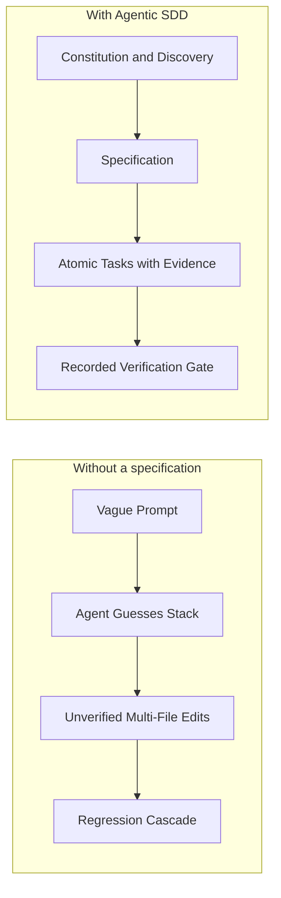
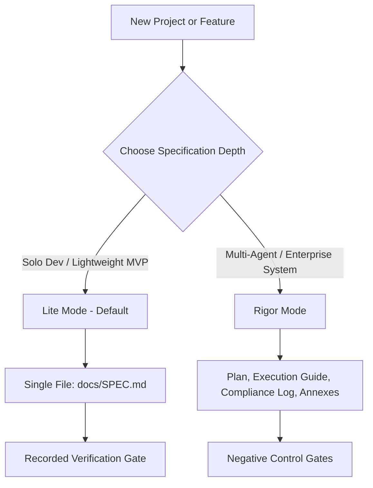

# Agentic SDD Framework

> Spec-Driven Development governance for AI coding agents: agent rules that load automatically, specifications with recorded evidence, and a quality gate that checks both before every push.

[](https://opensource.org/licenses/MIT)
[](https://github.com/tBeltty/agentic-sdd-framework/actions)

---

## 🎯 What It Does

AI coding agents (Claude Code, Antigravity, Cursor, Codex) write code quickly, and without constraints they also guess the stack, drift out of scope, and report work as done without running it. This framework adds three things to a repository:

1. **Agent rules that load without a prompt.** `AGENTS.md`, `CLAUDE.md`, and `.claude/skills/` point every supported agent at a constitution, an operational context file, and four on-demand skills.
2. **A specification with evidence.** Tasks are checked off with recorded command output, and a spec is completed only with a recorded verification run tied to the exact content it verified.
3. **A quality gate.** A pre-push hook checks the commits being pushed for secrets, prose rules, file size limits, and specification evidence.



---

## 🧭 Progressive Rigor: Two Specification Modes

Projects begin simply and scale as architectural complexity grows. The mode is set in `sdd.config.json`:



### 1. 🟢 Lite Mode (Default, Solo Developers)
* **Single Entry Point:** `docs/SPEC.md` holds context, architecture, atomic tasks, and the verification gate.
* **Recorded Evidence:** `sdd-verify --task <ID> -- <command>` runs a command and records its output as the task's evidence. `sdd-verify --record` runs the spec's verification command and records the result.
* **Best For:** Solo developers, utilities, early-stage MVPs.

### 2. 🔴 Rigor Mode (Opt-In, Multi-Agent Teams)
* **The Auditor-Executor document set** in `docs/roadmap/`, in the format of [auditor-executor-protocol](https://github.com/tBeltty/auditor-executor-protocol):
  * `plan-of-record.md`: the "what" and "why" (phases and trade-offs).
  * `execution-guide.md`: the "how" (numbered tasks `P<phase>-T<n>` and gates `P<phase>-G<n>`).
  * `compliance-log.md`: the ledger of pasted command output and verdicts.
  * `annexes/`: self-contained remediation orders issued after a verdict that is not a clean `APPROVED`.
* **Mechanical Checks:** the quality gate runs `auditkit lint` (0.3.3 or newer), which rejects missing or orphaned task entries, gates without a negative control, and `DONE` reports without pasted verify output.
* **Best For:** Multi-agent handoffs, asynchronous work, and regulated domains.

---

## ⚡ Quickstart

**Requirements:** Git and Node.js 22 LTS or newer (24 LTS recommended), for projects in any language. Rigor mode also needs Python 3.9+ for `auditkit`:

```bash
pipx install git+https://github.com/tBeltty/auditor-executor-protocol
```

### 1. Install into a Project (Recommended)
Run the wizard from the root of a new or existing Git repository. Pin a release tag so a later change to `main` never reaches you unannounced (see [CHANGELOG.md](CHANGELOG.md)):

```bash
cd my-project
npx github:tBeltty/agentic-sdd-framework#v1.4.0
```

Express mode skips the interview and takes every answer from flags:

```bash
npx github:tBeltty/agentic-sdd-framework#v1.4.0 --express --mode=lite --ast=ast-grep --runtime=go-1.23
```

### 2. Start from a Clone
Use the framework repository itself as the starting point of a new project:

```bash
git clone --branch v1.4.0 https://github.com/tBeltty/agentic-sdd-framework.git my-project
cd my-project
node scripts/sdd-init.js
```

### Wizard Flags

Flags take `--flag=value` or `--flag value`. Unknown flags are an error.

| Flag | Values | Default |
| :--- | :--- | :--- |
| `--express` | Non-interactive run | Guided mode on a terminal |
| `--target=<dir>` | Project to provision | Current directory |
| `--name=<name>` | Project name | Target directory name |
| `--runtime=<id>` | `node-24-lts`, `go-1.23`, `python-3.12`, ... | `node-24-lts` |
| `--mode=<mode>` | `lite`, `rigor` | `lite` |
| `--ast=<adapter>` | `ast-grep`, `graphify`, `ripgrep`, `lsp` | `ast-grep` |
| `--concurrency=`, `--hardware=`, `--workload=` | Discovery answers recorded in ADR-0001 | Small internal service |
| `--i18n`, `--pwa` | Enable the capability flags | Disabled |
| `--force` | Refresh copied skills, templates, and `.claude/skills/` copies | Keep existing copies |
| `--help` | Print usage | |

Rerunning the wizard is safe. Existing documents are kept, `sdd.config.json` is merged and validated (keys starting with `x-` are free-form), and `AGENTS.md` / `CLAUDE.md` are only rewritten while they carry the `sdd:managed` marker. If they already exist without it, the wizard says so and prints the line to add.

### What the Wizard Generates

| Path | Purpose |
| :--- | :--- |
| `AGENTS.md` | Entry point read automatically by Codex, Cursor, and other AGENTS.md-aware agents |
| `CLAUDE.md` | Imports the entry point, constitution, and context into Claude Code |
| `.claude/skills/` | Symlinks to `.agents/skills/` (copies where symlinks are unavailable) so Claude Code loads each skill on demand |
| `.agents/AGENTS.md` | Constitution: 8 non-negotiable rules, each with a "Why this rule exists" field |
| `.agents/CONTEXT.md` | Project facts, incident registry, technical debt, and non-goals |
| `docs/SPEC.md` (Lite) or `docs/roadmap/` (Rigor) | Active specification documents, checked by the quality gate |
| `docs/decisions/ADR-0001-stack-and-architecture.md` | Stack decision record seeded with the discovery answers |
| `sdd.config.json` | Configuration, validated against [`scripts/lib/sdd.config.schema.json`](scripts/lib/sdd.config.schema.json) |
| `.sdd/scripts/`, `.sdd/VERSION` | Quality gate tooling and its version (install mode only) |
| Git `pre-push` hook | Runs the quality gate on the pushed commits; an existing hook is kept as `pre-push.local` and runs first |

When `core.hooksPath` is set (Husky, lefthook, or a shared hooks directory), the wizard installs nothing there and prints the command to add to that hook manager instead.

---

## 🚦 Quality Gate

`node scripts/quality-gate.js` (`node .sdd/scripts/quality-gate.js` in installed projects) runs every check in one process and exits 1 if any fails. Each run reads files from one source:

| Invocation | Checks |
| :--- | :--- |
| *(no flag)* | Tracked files in the working tree |
| `--staged` | The index: what the next commit contains |
| `--ref=<commit>` or `--ref <commit>` | The content of that commit |
| `--push [remote]` | Pre-push mode (used by the hook): every check on the tip commit of each pushed ref, plus a secret scan of every new commit in the push (merge commits included), so a secret added and later removed is still caught. Refs whose commit is already on the remote are skipped |

Unknown flags are errors, so a typo never falls back to checking the working tree. A check that cannot read the repository (not a Git repository, Git error, unreadable file) fails; it never reports "0 files, all clean". An invalid `sdd.config.json` (unknown key, wrong type, unknown value) fails every check with the exact problem.

| Check | Script | Configuration (`sdd.config.json`) |
| :--- | :--- | :--- |
| Secret leak scanner | `verify-no-secrets.js` | `security.allowFiles`; the `sdd-allow-secret` line pragma (suppressions are counted in the report) |
| No-AI-Slop copy linter | `check-copy-slop.js` | `capabilities.noAiSlop.enabled`, `.exclude`, `.maxEmDashes` |
| File size limit | `check-file-size.js` | `architecture.maxLocPerFile` (0 disables), `architecture.maxLocExclude` |
| Specification check | `check-spec.js` | `specification.mode`, `.specFile`, `.roadmapDir`, `.requireRecordedEvidence` |
| Version sync | `check-versions.js` | Applies only when `project.type` is `framework` |

The secret scanner reports provider keys (Anthropic, OpenAI, Stripe, GitHub, Slack, Resend, AWS, Google), private key blocks (including PGP), credentials embedded in URLs, high-entropy values assigned to secret-named keys (`password`, `client_secret`, `access_token`, `SECRET_KEY`, `signing_key`, ...; unquoted values count in env, config, rc, shell, and Docker files), and tracked secret files (`.env`, `id_rsa`, `*.key`, `*.p12`, ...). It is a regex scanner, not a replacement for a dedicated tool such as gitleaks.

### What the Specification Check Enforces

| Mode | Rule |
| :--- | :--- |
| Lite, any status | Exactly one Status line: `Draft`, `In Progress`, or `Completed`; the `Verification Gate` section exists; every checked task (any checkbox list item, blockquotes included) has evidence; no HTML comment block holds a task, Status, gate field, or code fence |
| Lite, recorded evidence | Evidence written by `sdd-verify --task` must be unedited (the hash covers the date, exit code, and transcript) and exit 0 |
| Lite, hand-written evidence | Accepted and counted in the report; rejected when `specification.requireRecordedEvidence` is `true` |
| Lite, `In Progress` | The verification command and expected output are filled in, not template placeholders |
| Lite, `Completed` | Every task is checked, and `Last Verified` is an unedited PASS written by `sdd-verify --record` for the current verification command and expected output, whose state fingerprint matches the content the spec was completed with |
| Rigor | `auditkit lint docs/roadmap` exits 0 |

`sdd-verify --record` runs the spec's verification command, checks that every expected line appears in the output (`/.../` lines are regular expressions), fails if the command modified tracked files, and writes `Last Verified: <date> PASS|FAIL (commit <sha>, exit <code>, state <fingerprint>, check <hash>)`. The fingerprint covers every tracked file except the spec. The check hash covers the other fields plus the verification command and expected output, so editing the result, or changing the command after recording, reopens the spec. `--record` refuses to run while there are untracked files, because they would take part in the run without being part of the recorded state; commit, ignore, or remove them first. The gate recomputes it for the commit that completed the spec (or the uncommitted state), so files changed after the verification invalidate the PASS. Later commits that do not touch the spec do not reopen it: catching regressions after a spec is closed is the job of CI and tests.

Commands run in `specification.verifyShell` (default `/bin/sh` on macOS and Linux, `cmd.exe` on Windows) with a limit of `specification.verifyTimeoutSeconds` (default 900). The gate never runs a command from the spec itself; it only checks recorded results. On timeout the whole process tree is killed, including background processes the command started.

The check finds the commit that completed the spec in the Git history, so CI needs the full history: in GitHub Actions, use `actions/checkout` with `fetch-depth: 0`. In a shallow clone the check fails and says so.

The hashes are integrity checks, not signatures: they catch hand edits and stale records, but anyone who can run `sdd-verify` can also write a matching record. For an authoritative result, have CI run `sdd-verify` again. Recorded evidence also cannot prove a verification command is meaningful; that remains the reviewer's call.

`check-system-prerequisites.js` (Git identity, `gh` authentication, SSH keys) runs once inside the wizard and is available as `npm run check:prereqs`. It is not part of the gate because it depends on the local machine, not on the code.

---

## 🧠 Repository Layout

```text
agentic-sdd-framework/
├── .agents/
│   ├── AGENTS.template.md         # Constitution template (8 rules)
│   ├── CONTEXT.template.md        # Operational memory template
│   ├── ENTRYPOINT.template.md     # Root AGENTS.md template
│   └── skills/
│       ├── strategic-cto/         # 4-Pillar Discovery, Anti-Bloat, ROI Verdict
│       ├── auditor-executor-protocol/ # Execution protocol (tBeltty/auditor-executor-protocol)
│       ├── no-ai-slop/            # Factual copy rules (petergyang/no-ai-slop)
│       └── ast-navigator/         # Pluggable adapters (graphify, ast-grep, ripgrep, lsp)
│
├── docs/
│   ├── SPEC_TEMPLATE.md           # Lite Mode template
│   ├── decisions/ADR_TEMPLATE.md  # Architecture Decision Record template
│   ├── roadmap/templates/         # Rigor Mode templates (vendored from auditkit)
│   ├── incidents/                 # Post-mortem template
│   ├── guides/                    # Credential tiers, GitHub CLI setup
│   └── guidelines/                # AST navigation adapter comparison
│
├── scripts/
│   ├── sdd-init.js                # Bootstrapping wizard (guided and express)
│   ├── quality-gate.js            # Runs every check (working tree, index, commit, or push)
│   ├── verify-no-secrets.js       # Credential scanner
│   ├── check-copy-slop.js         # No-AI-Slop linter
│   ├── check-file-size.js         # maxLocPerFile enforcement
│   ├── check-spec.js              # Specification evidence check
│   ├── sdd-verify.js              # Runs and records verification commands and task evidence
│   ├── check-versions.js          # Framework version sync
│   ├── check-system-prerequisites.js # Day-0 Git, gh CLI, and SSH checks
│   ├── install-git-hooks.js       # pre-push hook installer
│   ├── lib/                       # Git sources, config schema, spec parser, provisioning
│   └── dev/sync-vendored.js       # Syncs and checks files vendored from auditor-executor-protocol
│
├── test/                          # node:test suites (npm test)
├── CHANGELOG.md                   # Release notes
└── sdd.config.json                # Configuration of this repository
```

---

## 📜 Open-Source Attributions

The **Agentic SDD Framework** integrates, adapts, or provides adapters for the following open-source projects:

| Component | Author / Organization | Upstream Repository | License | Role |
| :--- | :--- | :--- | :--- | :--- |
| **Auditor-Executor Protocol** | **tBeltty** | [tBeltty/auditor-executor-protocol](https://github.com/tBeltty/auditor-executor-protocol) | MIT | Multi-agent coordination, Rigor Mode documents, and negative control gates. |
| **Spec-Kit Concepts** | **GitHub** | [github/spec-kit](https://github.com/github/spec-kit) | MIT | Progressive specification hierarchy, unified single-spec model, and interactive constitution. |
| **No-AI-Slop** | **Peter Yang** | [petergyang/no-ai-slop](https://github.com/petergyang/no-ai-slop) | MIT | Writing rules behind the copy linter. |
| **Graphify** | **Graphify Labs** | [Graphify-Labs/graphify](https://github.com/Graphify-Labs/graphify) | Apache 2.0 | Relational knowledge graph adapter for code navigation. |
| **ast-grep** | **Herrington Darkholme** | [ast-grep/ast-grep](https://github.com/ast-grep/ast-grep) | MIT | Tree-sitter structural search adapter. |
| **ripgrep** | **Andrew Gallant** | [BurntSushi/ripgrep](https://github.com/BurntSushi/ripgrep) | MIT / Unlicense | Regex text search adapter. |
| **SCIP / LSP** | **SCIP Code** (originally Sourcegraph) | [scip-code/scip](https://github.com/scip-code/scip) | Apache 2.0 | Language Server Protocol code intelligence adapter. |

---

## 🛡️ License

This repository is licensed under the [MIT License](LICENSE). The vendored `no-ai-slop` skill keeps its upstream MIT license ([`.agents/skills/no-ai-slop/LICENSE`](.agents/skills/no-ai-slop/LICENSE)).
