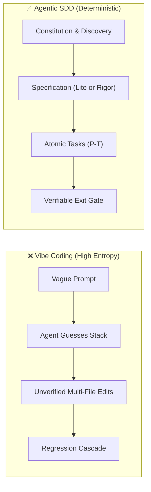
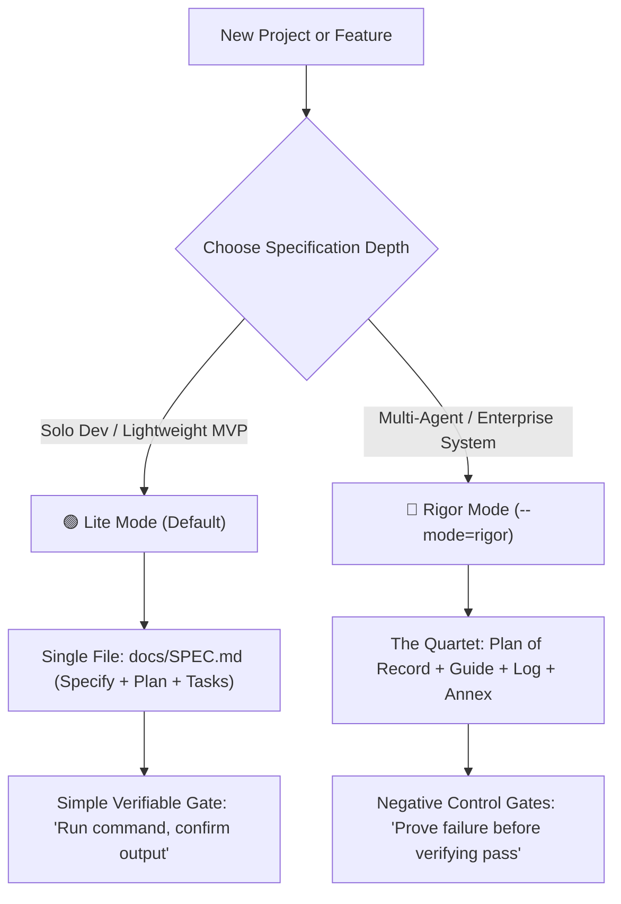

# Agentic SDD Framework
*The Universal Open-Source Operating System for Spec-Driven Development with AI Agents*

[](https://opensource.org/licenses/MIT)
[](https://github.com/tBeltty/agentic-sdd-framework/actions)

---

## 🎯 Manifesto

Autonomous AI coding agents (Claude Code, Antigravity, Cursor, Codex) possess high code-generation velocity, but unconstrained generation leads to **Vibe Coding** regressions: premature architectural assumptions, scope drift, context exhaustion, and untracked failures.

The **Agentic SDD Framework** provides an educational and industrial operating system that transitions software engineering from prompt-and-pray development into verifiable **Spec-Driven Development (SDD)**.



---

## 🧭 Progressive Rigor: Two Specification Modes

Projects begin simply and scale as architectural complexity grows. The framework provides two specification tiers configured via `sdd.config.json`:



### 1. 🟢 Lite Mode (Default — Solo Developers)
* **Single Entry Point:** Everything lives in `docs/SPEC.md` (Context, Architecture, Atomic Tasks, and Gate).
* **Verifiable Gate:** Requires a passing terminal command and expected output before closing.
* **Best For:** Solo developers, utilities, early-stage MVPs.

### 2. 🔴 Rigor Mode (Opt-In — Multi-Agent Teams)
* **The 4-Document Quartet:**
  * `PLAN_OF_RECORD.md`: The "What" and "Why" (Phases and trade-offs).
  * `EXECUTION_GUIDE.md`: The "How" (Numbered tasks `P<phase>-T<n>` and gates `P<phase>-G<n>`).
  * `COMPLIANCE_LOG.md`: The verifiable ledger of terminal evidence.
  * `REMEDIATION_ORDER.md`: Formal self-contained annexes (`ANNEX_A..Z`) for defect resolution.
* **Negative Controls:** Critical security and boundary gates require demonstrating the test fails without the fix and passes when restored.
* **Best For:** Multi-agent swarms, asynchronous handoffs, and regulated domains.

---

## ⚡ Quickstart

### 1. Interactive Bootstrapping (Guided Mode)
Run the built-in wizard to conduct system diagnostics and configure project governance:

```bash
# Clone the repository
git clone https://github.com/tBeltty/agentic-sdd-framework.git my-project
cd my-project

# Run interactive setup wizard (Zero npm dependencies required)
node scripts/sdd-init.js
```

### 2. Rapid Bootstrapping (Express Mode)
For senior engineers wanting instant provisioning via CLI flags:

```bash
node scripts/sdd-init.js --express --mode=lite --ast=ast-grep --runtime=go-1.23
```

---

## 🧠 The Agent Sandboxing Core

```text
agentic-sdd-framework/
├── .agents/
│   ├── AGENTS.md                  # 10 Non-negotiable laws with "# Why this rule exists"
│   ├── CONTEXT.md                 # Operational memory and incident registry
│   └── skills/
│       ├── strategic-cto/         # 4-Pillar Discovery, Anti-Bloat, ROI Verdict
│       ├── auditor-executor/      # Execution engine (tBeltty/auditor-executor-protocol)
│       ├── no-ai-slop/            # Factual copy filter (petergyang/no-ai-slop)
│       └── ast-navigator/         # Pluggable adapters (graphify, ast-grep, ripgrep, lsp)
│
├── docs/
│   ├── SPEC_TEMPLATE.md           # Lite Mode template
│   ├── decisions/ADR-0001.md      # Architecture Decision Record template
│   ├── roadmap/                   # Rigor Mode Quartet templates
│   └── guidelines/                # Zero-trust secrets, AST navigation, testing rules
│
├── scripts/
│   ├── sdd-init.js                # Dual-mode bootstrapping wizard
│   ├── check-system-prerequisites.js # Day-0 Git, gh CLI, and runtime checks
│   ├── verify-no-secrets.js       # Pre-commit credential scanner
│   ├── check-copy-slop.js         # Automated No-AI-Slop linter
│   └── check-versions.js          # Monorepo version sync validator
│
└── sdd.config.json                # Active capability manifest
```

---

## 📜 Open-Source Attributions

The **Agentic SDD Framework** integrates, adapts, or provides adapters for the following foundational open-source projects:

| Component | Author / Organization | Upstream Repository | License | Role |
| :--- | :--- | :--- | :--- | :--- |
| **Auditor-Executor Protocol** | **tBeltty** | [tBeltty/auditor-executor-protocol](https://github.com/tBeltty/auditor-executor-protocol) | MIT | Multi-agent coordination, Rigor Mode execution, and negative control gates. |
| **Spec-Kit Concepts** | **GitHub** | [github/spec-kit](https://github.com/github/spec-kit) | MIT | Progressive specification hierarchy, unified single-spec model, and interactive constitution. |
| **No-AI-Slop** | **Peter Yang** | [petergyang/no-ai-slop](https://github.com/petergyang/no-ai-slop) | MIT | Automated copy/documentation anti-slop linter and factual communication standard. |
| **Graphify** | **Graphify Labs** | [Graphify-Labs/graphify](https://github.com/Graphify-Labs/graphify) | Apache 2.0 / MIT | Relational knowledge graph adapter for context-efficient code navigation. |
| **ast-grep** | **Herrington Darkholme** | [ast-grep/ast-grep](https://github.com/ast-grep/ast-grep) | MIT | Tree-sitter structural syntax search adapter in native binary. |
| **ripgrep** | **Andrew Gallant** | [BurntSushi/ripgrep](https://github.com/BurntSushi/ripgrep) | MIT / Unlicense | Ultra-fast regex text search engine. |
| **SCIP / LSP** | **Sourcegraph** | [sourcegraph/scip](https://github.com/sourcegraph/scip) | Apache 2.0 | Language Server Protocol code intelligence adapter. |

---

## 🛡️ License

Root repository is licensed under the [MIT License](LICENSE). Individual skill submodules retain their upstream open-source licenses as documented in their respective directories.
