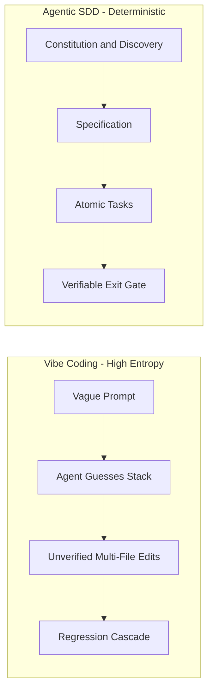
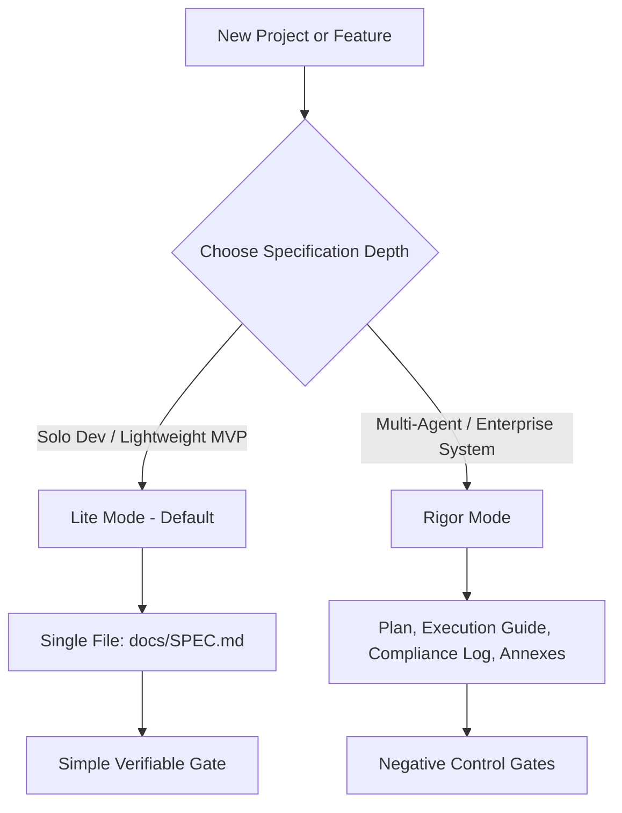

# Agentic SDD Framework

> The Universal Open-Source Operating System for Spec-Driven Development with AI Agents

[](https://opensource.org/licenses/MIT)
[](https://github.com/tBeltty/agentic-sdd-framework/actions)

---

## 🎯 Manifesto

Autonomous AI coding agents (Claude Code, Antigravity, Cursor, Codex) possess high code-generation velocity, but unconstrained generation leads to **Vibe Coding** regressions: premature architectural assumptions, scope drift, context exhaustion, and untracked failures.

The **Agentic SDD Framework** provides an educational and industrial operating system that transitions software engineering from prompt-and-pray development into verifiable **Spec-Driven Development (SDD)**.



---

## 🧭 Progressive Rigor: Two Specification Modes

Projects begin simply and scale as architectural complexity grows. The framework provides two specification tiers configured via `sdd.config.json`:



### 1. 🟢 Lite Mode (Default, Solo Developers)
* **Single Entry Point:** Everything lives in `docs/SPEC.md` (Context, Architecture, Atomic Tasks, and Gate).
* **Verifiable Gate:** Requires a passing terminal command and expected output before closing. `sdd-verify` runs it and records the result; the quality gate rejects checked tasks without evidence and a `Completed` spec without a recorded PASS.
* **Best For:** Solo developers, utilities, early-stage MVPs.

### 2. 🔴 Rigor Mode (Opt-In, Multi-Agent Teams)
* **The Auditor-Executor document set** in `docs/roadmap/`, in the format of [auditor-executor-protocol](https://github.com/tBeltty/auditor-executor-protocol):
  * `plan-of-record.md`: The "What" and "Why" (Phases and trade-offs).
  * `execution-guide.md`: The "How" (Numbered tasks `P<phase>-T<n>` and gates `P<phase>-G<n>`).
  * `compliance-log.md`: The verifiable ledger of terminal evidence.
  * `annexes/`: Self-contained remediation orders issued after a verdict that is not a clean `APPROVED`.
* **Mechanical Checks:** the quality gate runs `auditkit lint`, which rejects task IDs missing from the log, gates without a negative control, and `DONE` reports without pasted verify output. Install it with `pipx install git+https://github.com/tBeltty/auditor-executor-protocol`.
* **Negative Controls:** Critical security and boundary gates require demonstrating the test fails without the fix and passes when restored.
* **Best For:** Multi-agent swarms, asynchronous handoffs, and regulated domains.

---

## ⚡ Quickstart

Requires Node.js 22 LTS or newer (24 LTS recommended) and Git. The framework has zero npm dependencies and works for projects in any language.

### 1. Install into a Project (Recommended)
Run the wizard from the root of a new or existing Git repository:

```bash
cd my-project
npx github:tBeltty/agentic-sdd-framework
```

Express mode skips the interview and takes every answer from flags:

```bash
npx github:tBeltty/agentic-sdd-framework --express --mode=lite --ast=ast-grep --runtime=go-1.23
```

### 2. Start from a Clone
Use the framework repository itself as the starting point of a new project:

```bash
git clone https://github.com/tBeltty/agentic-sdd-framework.git my-project
cd my-project
node scripts/sdd-init.js
```

### Wizard Flags

| Flag | Values | Default |
| :--- | :--- | :--- |
| `--express` | Non-interactive run | Guided mode on a terminal |
| `--target=<dir>` | Project to provision | Current directory |
| `--name=<name>` | Project name | Target directory name |
| `--runtime=<id>` | `node-24-lts`, `go-1.23`, `python-3.12`, ... | `node-24-lts` |
| `--mode=<mode>` | `lite`, `rigor` | `lite` |
| `--ast=<adapter>` | `ast-grep`, `graphify`, `ripgrep`, `lsp` | `ast-grep` |
| `--concurrency=`, `--hardware=`, `--workload=` | Discovery answers recorded in ADR-0001 | Small internal service |
| `--i18n`, `--pwa` | Enable the capability flags | Disabled |
| `--force` | Refresh copied skills and templates | Keep existing copies |

Rerunning the wizard is safe. Existing documents are kept, `sdd.config.json` is merged (custom keys survive), and `AGENTS.md` / `CLAUDE.md` are only rewritten while they carry the `sdd:managed` marker.

### What the Wizard Generates

| Path | Purpose |
| :--- | :--- |
| `AGENTS.md` | Entry point read automatically by Codex, Cursor, and other AGENTS.md-aware agents |
| `CLAUDE.md` | Imports the entry point, constitution, and context into Claude Code |
| `.claude/skills/` | Symlinks to `.agents/skills/` so Claude Code loads each skill on demand |
| `.agents/AGENTS.md` | Constitution: 8 non-negotiable rules, each with a "Why this rule exists" field |
| `.agents/CONTEXT.md` | Project facts, incident registry, technical debt, and non-goals |
| `docs/SPEC.md` (Lite) or `docs/roadmap/` (Rigor) | Active specification documents, checked by the quality gate |
| `docs/decisions/ADR-0001-stack-and-architecture.md` | Stack decision record seeded with the discovery answers |
| `sdd.config.json` | Capability manifest read by the quality gate |
| `.sdd/scripts/` | Quality gate tooling (install mode only) |
| Git `pre-push` hook | Runs the quality gate; an existing hook is kept as `pre-push.local` and runs first |

---

## 🚦 Quality Gate

`node scripts/quality-gate.js` (`node .sdd/scripts/quality-gate.js` in installed projects) runs every check in one process and exits 1 if any fails. Add `--staged` to check the Git index instead of all tracked files.

| Check | Script | Configuration (`sdd.config.json`) |
| :--- | :--- | :--- |
| Secret leak scanner | `verify-no-secrets.js` | Add `sdd-allow-secret` to a line to accept a known false positive |
| No-AI-Slop copy linter | `check-copy-slop.js` | `capabilities.noAiSlop.enabled`, `.exclude`, `.maxEmDashes` |
| File size limit | `check-file-size.js` | `architecture.maxLocPerFile` (0 disables), `architecture.maxLocExclude` |
| Specification check | `check-spec.js` | `specification.mode`, `.specFile` (default `docs/SPEC.md`), `.roadmapDir` (default `docs/roadmap`) |
| Version sync | `check-versions.js` | Applies only when `project.type` is `framework` |

### What the Specification Check Enforces

| Mode | Rule |
| :--- | :--- |
| Lite, any status | The `Verification Gate` section exists; every checked task has pasted **Evidence** |
| Lite, `In Progress` | The verification command and expected output are filled in, not template placeholders |
| Lite, `Completed` | Every task is checked and `Last Verified` records a PASS |
| Rigor | `auditkit lint docs/roadmap` exits 0 |

`node scripts/sdd-verify.js --record` (`.sdd/scripts/` in installed projects) runs the spec's verification command, checks that every expected line appears in the output (`/.../` lines are regular expressions), and writes `Last Verified: <date> PASS|FAIL (commit <sha>, exit <code>)` into the spec. The gate never runs the spec's command itself; it only checks the recorded result.

`check-system-prerequisites.js` (Git identity, `gh` authentication, SSH keys) runs once inside the wizard and is available as `npm run check:prereqs`. It is not part of the gate because it depends on the local machine, not on the code.

---

## 🧠 Repository Layout

```text
agentic-sdd-framework/
├── .agents/
│   ├── AGENTS.template.md         # Constitution template (8 rules)
│   ├── CONTEXT.template.md        # Operational memory template
│   ├── ENTRYPOINT.template.md     # Root AGENTS.md template
│   └── skills/
│       ├── strategic-cto/         # 4-Pillar Discovery, Anti-Bloat, ROI Verdict
│       ├── auditor-executor-protocol/ # Execution engine (tBeltty/auditor-executor-protocol)
│       ├── no-ai-slop/            # Factual copy rules (petergyang/no-ai-slop)
│       └── ast-navigator/         # Pluggable adapters (graphify, ast-grep, ripgrep, lsp)
│
├── docs/
│   ├── SPEC_TEMPLATE.md           # Lite Mode template
│   ├── decisions/ADR_TEMPLATE.md  # Architecture Decision Record template
│   ├── roadmap/templates/         # Rigor Mode templates (vendored from auditkit)
│   ├── incidents/                 # Post-mortem template
│   ├── guides/                    # Credential tiers, GitHub CLI setup
│   └── guidelines/                # AST navigation adapter comparison
│
├── scripts/
│   ├── sdd-init.js                # Bootstrapping wizard (guided and express)
│   ├── quality-gate.js            # Runs every check below
│   ├── verify-no-secrets.js       # Credential scanner
│   ├── check-copy-slop.js         # No-AI-Slop linter
│   ├── check-file-size.js         # maxLocPerFile enforcement
│   ├── check-spec.js              # Specification evidence check
│   ├── sdd-verify.js              # Runs and records the spec's verification gate
│   ├── check-versions.js          # Framework version sync
│   ├── check-system-prerequisites.js # Day-0 Git, gh CLI, and SSH checks
│   ├── install-git-hooks.js       # pre-push hook installer
│   ├── lib/                       # Shared helpers, spec parser, provisioning logic
│   └── dev/sync-vendored.js       # Syncs and checks files vendored from auditor-executor-protocol
│
├── test/                          # node:test suites (npm test)
└── sdd.config.json                # Capability manifest of this repository
```

---

## 📜 Open-Source Attributions

The **Agentic SDD Framework** integrates, adapts, or provides adapters for the following foundational open-source projects:

| Component | Author / Organization | Upstream Repository | License | Role |
| :--- | :--- | :--- | :--- | :--- |
| **Auditor-Executor Protocol** | **tBeltty** | [tBeltty/auditor-executor-protocol](https://github.com/tBeltty/auditor-executor-protocol) | MIT | Multi-agent coordination, Rigor Mode execution, and negative control gates. |
| **Spec-Kit Concepts** | **GitHub** | [github/spec-kit](https://github.com/github/spec-kit) | MIT | Progressive specification hierarchy, unified single-spec model, and interactive constitution. |
| **No-AI-Slop** | **Peter Yang** | [petergyang/no-ai-slop](https://github.com/petergyang/no-ai-slop) | MIT | Automated copy/documentation anti-slop linter and factual communication standard. |
| **Graphify** | **Graphify Labs** | [Graphify-Labs/graphify](https://github.com/Graphify-Labs/graphify) | Apache 2.0 | Relational knowledge graph adapter for context-efficient code navigation. |
| **ast-grep** | **Herrington Darkholme** | [ast-grep/ast-grep](https://github.com/ast-grep/ast-grep) | MIT | Tree-sitter structural syntax search adapter in native binary. |
| **ripgrep** | **Andrew Gallant** | [BurntSushi/ripgrep](https://github.com/BurntSushi/ripgrep) | MIT / Unlicense | Ultra-fast regex text search engine. |
| **SCIP / LSP** | **SCIP Code** (originally Sourcegraph) | [scip-code/scip](https://github.com/scip-code/scip) | Apache 2.0 | Language Server Protocol code intelligence adapter. |

---

## 🛡️ License

Root repository is licensed under the [MIT License](LICENSE). Individual skill submodules retain their upstream open-source licenses as documented in their respective directories.
